# Semiconductor Revenue Downturn and Recovery in the AI Era
# จากภาวะชะลอตัวสู่การฟื้นตัวในยุค AI: การเปลี่ยนแปลงของรายได้ในอุตสาหกรรมเซมิคอนดักเตอร์

เเหล่งที่มาข้อมูล : https://www.kaggle.com/datasets/sergionefedov/global-semiconductor-industry-2010-2026/data

เซมิคอนดักเตอร์เป็นส่วนประกอบพื้นฐานของผลิตภัณฑ์และโครงสร้างพื้นฐานดิจิทัล ตั้งแต่คอมพิวเตอร์ สมาร์ตโฟน ยานยนต์ และอุปกรณ์อิเล็กทรอนิกส์ ไปจนถึงศูนย์ข้อมูล ระบบประมวลผลสมรรถนะสูง และเทคโนโลยีปัญญาประดิษฐ์ อย่างไรก็ตาม อุตสาหกรรมนี้ไม่ได้เติบโตอย่างต่อเนื่องในทิศทางเดียว แต่มีลักษณะเป็นวัฏจักรและได้รับอิทธิพลจากหลายปัจจัย เช่น ความต้องการของตลาดปลายทาง ราคาชิป ระดับสินค้าคงคลัง กำลังการผลิต การลงทุนด้านเทคโนโลยี และการเปลี่ยนผ่านระหว่างผลิตภัณฑ์แต่ละรุ่น

ข้อมูลเบื้องต้นของบริษัทที่อยู่ในชุดข้อมูลแสดงให้เห็นประเด็นที่น่าสนใจ กล่าวคือ รายได้รวมของบริษัทที่เป็นตัวแทนเพิ่มขึ้นจาก 235.00 พันล้านดอลลาร์สหรัฐในปี 2010 เป็น 697.46 พันล้านดอลลาร์สหรัฐในปี 2022 ก่อนลดลงเหลือ 654.40 พันล้านดอลลาร์สหรัฐในปี 2023 และกลับมาฟื้นตัวอย่างชัดเจนในปี 2024–2025 การลดลงในปี 2023 จึงเป็นจุดเปลี่ยนสำคัญของโครงการ เนื่องจากเกิดขึ้นในช่วงที่เทคโนโลยีขั้นสูง เช่นเมื่อเทคโนโลยี AI เริ่มได้รับความสนใจอย่างกว้างขวาง และทำให้เกิดสภาวะขาดเเคลน semiconductors ไปทั่วโลก

ปรากฏการณ์ดังกล่าวนำไปสู่คำถามว่า เหตุใดรายได้รวมของบริษัทเซมิคอนดักเตอร์ในชุดข้อมูลจึงลดลงในปี 2023 แม้ว่าความต้องการด้าน AI จะเริ่มเติบโต คำอธิบายหนึ่งที่ควรตรวจสอบคือ การเติบโตจากตลาด AI ในระยะแรกอาจยังไม่มากพอที่จะชดเชยความอ่อนแอของตลาดเซมิคอนดักเตอร์แบบดั้งเดิม โดยเฉพาะตลาดหน่วยความจำทั่วไป นอกจากนี้ ผลกระทบอาจกระจุกตัวอยู่ในกลุ่มธุรกิจบางประเภท มากกว่าจะเกิดขึ้นอย่างเท่าเทียมกันตลอดทั้งห่วงโซ่คุณค่าในอุตสาหกรรม

เพื่อศึกษาประเด็นดังกล่าว โครงการนี้แบ่งบริษัทออกเป็นห้ากลุ่มตามบทบาทในห่วงโซ่คุณค่าเซมิคอนดักเตอร์ ได้แก่ 

- **Foundry : บริษัทที่รับจ้างผลิต wafer หรือ microchip ให้กับบริษัทอื่น เเละมีโรงงานของตัวเอง**

- **Fabless : บริษัทที่รับออกเเบบลายวงจร microchip เเต่ไม่มีโรงงานของตัวเอง**

- **IDM : มีผลิตภัณฑ์เเละโรงงานเป็นของตัวเอง ตั้งเเต่การออกเเบบ microchip wafer assembly จนถึง Final Test**

- **Equipment : บริษัทที่ผลิตเครื่องจักรอุปกรณ์ที่ใช้ในอุตสาหกรรมเซมิคอนดักเตอร์**

- **EDA Software : บริษัทที่รับจ้างทำ software เพื่อใช้ในเครื่องจักสำหรับ การผลิต ประกอบ ทดสอบ ผลิตภัณฑ์**

การวิเคราะห์เริ่มจากการอธิบายภาพรวมของห่วงโซ่คุณค่าและการกระจายตัวของธุรกิจตามประเทศหรือภูมิภาค จากนั้นจึงวิเคราะห์แนวโน้มรายได้ระหว่างปี 2010–2025 เพื่อระบุความผิดปกติในปี 2023 และตรวจสอบบริบทด้านราคาผลิตภัณฑ์ โดยเปรียบเทียบ DRAM DDR4 และ NAND MLC ซึ่งเป็นหน่วยความจำสำหรับตลาดทั่วไปกับ HBM3 ซึ่งเป็นหน่วยความจำประสิทธิภาพสูงสำหรับ GPU และระบบ AI ขั้นต่อไปจะวิเคราะห์ว่ารายได้ที่ลดลงกระจุกตัวอยู่ในกลุ่มธุรกิจและบริษัทใด ก่อนพิจารณาว่าการฟื้นตัวในระยะหลังมีความสัมพันธ์กับการเติบโตของบริษัทที่เกี่ยวข้องกับ AI มากน้อยเพียงใด

โครงการใช้ Python, Pandas และ Matplotlib ในการเตรียมข้อมูล คำนวณตัวชี้วัด และสร้างภาพประกอบ โดยพิจารณาทั้งรายได้ การเติบโตของรายได้ ราคาผลิตภัณฑ์ ความสามารถในการทำกำไร การลงทุนด้านการวิจัยและพัฒนา เพื่อเชื่อมโยงการเปลี่ยนแปลงทางการเงินเข้ากับโครงสร้างของห่วงโซ่คุณค่า 

## Research question and initial hypothesis

เหตุใดรายได้รวมของบริษัทเซมิคอนดักเตอร์ที่อยู่ในชุดข้อมูลจึงลดลงในปี 2023 ก่อนฟื้นตัวอย่างชัดเจนในช่วงปี 2024–2025 และการเปลี่ยนแปลงดังกล่าวกระจุกตัวอยู่ในบริษัทหรือกลุ่มธุรกิจส่วนใดของห่วงโซ่คุณค่าเซมิคอนดักเตอร์?

ในส่วนของโครงการนี้จะตั้งสมมติฐานเบื้องต้นว่า การลดลงของรายได้ในปี 2023 อาจไม่ได้เกิดขึ้นอย่างเท่าเทียมกันในทุกประเภทของบริษัทในอุตสาหกรรม แต่อาจกระจุกตัวอยู่ในบริษัทที่มีรายได้เกี่ยวข้องกับตลาดหน่วยความจำแบบดั้งเดิม โดยเฉพาะ DRAM และ NAND ซึ่งเผชิญแรงกดดันด้านราคาในช่วงเวลาเดียวกัน ซึ่งสวนทางกับผลิตภัณฑ์ที่เกี่ยวข้องกับการประมวลผลที่มีประสิทธิภาพมากกว่า เช่น HBM แต่ในระยะแรกยังไม่มีความสามารถเพียงพอที่จะชดเชยความอ่อนแอของตลาดเซมิคอนดักเตอร์ส่วนอื่นได้ทั้งหมด

สำหรับการฟื้นตัวหลังปี 2023 โครงการตั้งสมมติฐานว่า รายได้ที่เพิ่มขึ้นอาจกระจุกตัวอยู่ในบริษัทและกลุ่มธุรกิจที่ได้รับประโยชน์จากการลงทุนด้านศูนย์ข้อมูล หรือบริษัทที่มีผลิตภัณฑ์ที่มีประสิทธิภาพสูง โดยเฉพาะกลุ่ม Fabless หรือ บริษัทที่มีผลิตภัณฑ์ประเภท GPU เป็นต้น

## Data sources and scope

โครงการใช้ชุดข้อมูลบริษัทในอุตสาหกรรมเซมิคอนดักเตอร์จาก Kaggle ซึ่งครอบคลุมข้อมูลทางการเงินระดับบริษัทและหน่วยธุรกิจในช่วงปี 2010–2026 การวิเคราะห์รายได้หลักแบ่งบริษัทออกเป็นห้ากลุ่มตามบทบาทในห่วงโซ่คุณค่า ได้แก่ Foundry, Fabless, IDM, Equipment และ EDA Software เพื่อเปรียบเทียบทั้งแนวโน้มรายได้รวม ความแตกต่างระหว่างกลุ่ม และการกระจุกตัวของการเปลี่ยนแปลงรายได้ในระดับบริษัท

## Data preparation and methodology

เราใช้ Python และ Pandas ตรวจสอบข้อมูลการเงินก่อนวิเคราะห์ โดยตรวจชนิดข้อมูลและรายการบริษัท–ปีที่ซ้ำกัน ข้อมูลดิบและตัวเลขการเงินต้นฉบับไม่ได้ถูกแก้ไขหรือลบแถวที่มีค่าผิดปกติโดยไม่มีหลักฐาน แต่เพิ่มเครื่องหมายกำกับรายการที่ควรตรวจสอบ เช่น รหัสภูมิศาสตร์และรายได้จากการดำเนินงานที่ไม่สอดคล้องกับค่าคำนวณ

สำหรับกราฟรายได้หลัก เราใช้ข้อมูลปี 2010–2025 คำนวณรายได้รวมและจำนวนกิจการในแต่ละปี จากนั้นรวมรายได้ตามกลุ่มธุรกิจในแต่ละปี แล้วหาค่าเฉลี่ยรายปีของสามช่วงเวลา ได้แก่ 2010–2021, 2022 และ 2023–2025 โดยเเบ่งเป็นยุคก่อนเปลี่ยนผ่าน(อุตสาหกรรมยานยนต์) ยุคเปลี่ยนผ่าน ยุคเทคโนโลยี AI นอกจากนี้ยังเปรียบเทียบการเปลี่ยนแปลงรายได้ของบริษัทระหว่างปี 2022 กับ 2025 และ เปรียบเทียบสัดส่วนรายได้ของบริษัทขนาดใหญ่ภายในชุดข้อมูล

<h2 align="left">
1. กระบวนการประกอบเซมิคอนดักเตอร์
</h2>

ในส่วนนี้ขอนำเสนอคร่าวๆ สำหรับขั้นตอนในการประกอบตัว semiconductors เเบบภาพรวมก่อนเพื่อให้เข้าใจว่าการประกอบนั้นมีขั้นตอนอะไรบ้าง

กระบวนการประกอบและทดสอบเซมิคอนดักเตอร์เริ่มจากการนำ Wafer ที่ผ่านการฉายเเสงเพื่อสร้างวงจรแล้วมาตัดด้วยกระบวนการ Wafer Saw เพื่อแยกออกเป็น Die แต่ละชิ้น จากนั้นนำ Die ไปติดบน Leadframe ด้วยกระบวนการ Die Attach และเชื่อมต่อทางไฟฟ้าด้วย Wire Bonding ก่อนที่จะฉีด Mold Compound เพื่อป้องกันความเสียหายของหน้า die หลังจากนั้นทำ Marking เพื่อระบุข้อมูลผู้ผลิต ทำ Plating เพื่อเคลือบผิว leadframe และทำ Trim/Form/Singulation เพื่อตัดแยกและขึ้นรูป Package ก่อนเข้าสู่ Final Test เพื่อตรวจสอบคุณภาพและฟังก์ชั่นทางไฟฟ้าของผลิตภัณฑ์ก่อนส่งมอบให้ลูกค้า

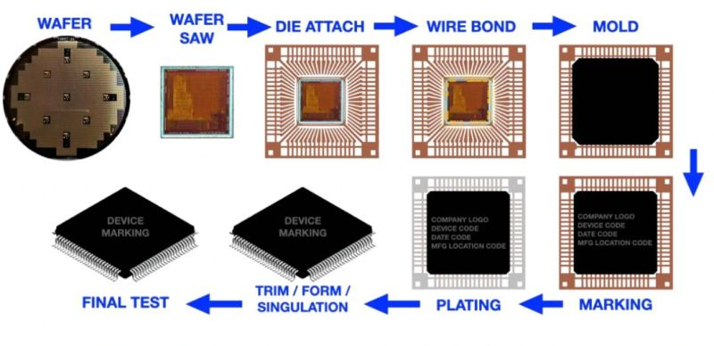

<i>Figure 1. ตัวอย่างภาพรวมกระบวนการของขั้นตอนการทำ IC packaging</i>

<i>Credit : <a href="https://www.linkedin.com/posts/surendharasic_semiconductor-icpackaging-vlsi-share-7340966509801836545-_wI9/?lipi=urn%3Ali%3Apage%3Ad_flagship3_detail_base%3BiZo8aoIcStSM7vQdjHgcCw%3D%3D">Semiconductor assembly process</a></i>

<h2 align="left">
2. กลุ่มอุตสาหกรรมหลักในห่วงโซ่เซมิคอนดักเตอร์ของเเต่ละประเทศเเละภูมิภาค
</h2>

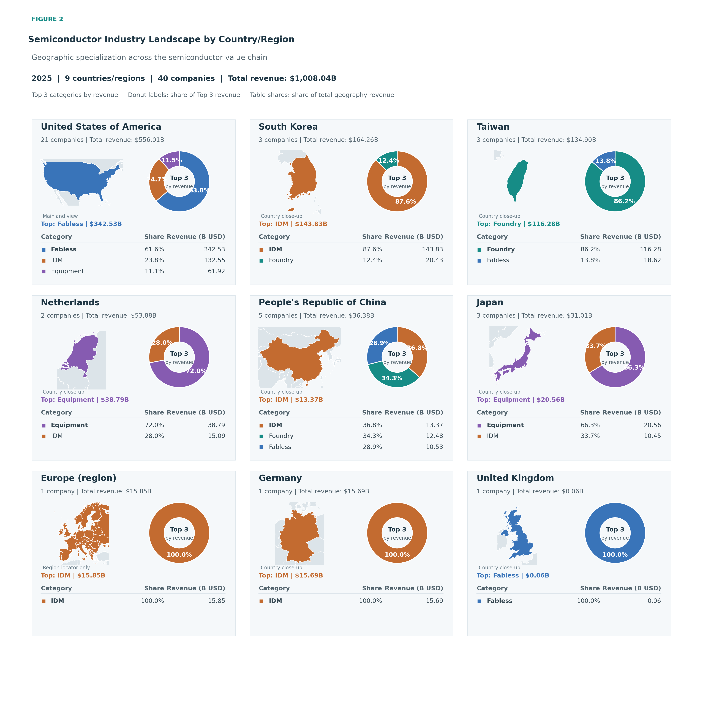

<i>Figure 2. โครงสร้างอุตสาหกรรมเซมิคอนดักเตอร์แตกต่างกันตามประเทศอย่างไร</i>

Figure 2 แสดงว่าบริษัทเซมิคอนดักเตอร์ในแต่ละประเทศมีบทบาททางธุรกิจแตกต่างกัน โดยวิเคราะห์บริษัท 40 แห่งในปี 2025 ซึ่งมีรายได้รวมประมาณ 1 ล้านล้านดอลลาร์สหรัฐ

ขั้นแรก เมื่อพิจารณาการกระจายรายได้ตามประเทศ พบว่าสหรัฐอเมริกามีรายได้สูงที่สุดที่ 556.01 พันล้านดอลลาร์ หรือประมาณ 55.2% ของรายได้ทั้งหมดในชุดข้อมูล รองลงมาคือเกาหลีใต้ 164.26 พันล้านดอลลาร์ และไต้หวัน 134.90 พันล้านดอลลาร์ เมื่อรวมทั้งสามพื้นที่จะคิดเป็นประมาณ 84.8% ของรายได้ทั้งหมด แสดงว่ารายได้ในชุดข้อมูลกระจุกตัวอยู่ในบริษัทจากสามพื้นที่นี้เป็นหลัก

ขั้นต่อมา เมื่อพิจารณาลงไปถึงประเภทของธุรกิจ พบว่าสหรัฐอเมริกามีรายได้ส่วนใหญ่มาจากกลุ่ม Fabless หรือบริษัทที่รับเฉพาะการออกเเบบ microchip แต่ไม่มีโรงงานผลิตของตนเอง ขณะที่เกาหลีใต้จะเน้นเป็นกลุ่ม IDM ซึ่งดำเนินงานทั้งด้านการออกแบบและการผลิต ส่วนไต้หวันมีรายได้ส่วนใหญ่มาจาก Foundry หรือธุรกิจรับจ้างผลิต wafer สำหรับเนเธอร์แลนด์และญี่ปุ่น รายได้ส่วนใหญ่ในชุดข้อมูลมาจาก Equipment หรือบริษัทผู้ผลิตเครื่องจักรสำหรับโรงงานเซมิคอนดักเตอร์ ขณะที่จีนมีรายได้กระจายระหว่าง IDM, Foundry และ Fabless มากกว่าประเทศอื่น

ผลลัพธ์นี้แสดงให้เห็นว่า ห่วงโซ่คุณค่าเซมิคอนดักเตอร์ต้องพึ่งพาความเชี่ยวชาญจากหลายประเทศ ตั้งแต่การออกแบบชิป การผลิต ไปจนถึงการจัดหาเครื่องจักร 
</h2>

<h2 align="left">
3. ความสามารถในการทำกำไรเเตกต่างกันตามรูปแบบแต่ละธุรกิจในห่วงโซ่เซมิคอนดักเตอร์
</h2>

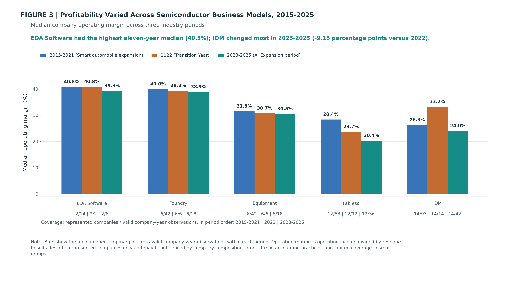

<i>Figure 3. ค่ามัธยฐานของอัตรากำไรจากการดำเนินงานจำแนกตามรูปแบบธุรกิจในห่วงโซ่คุณค่าเซมิคอนดักเตอร์ ช่วงปี 2015–2025</i>

Figure 3 เปรียบเทียบค่ามัธยฐานของอัตรากำไรจากการดำเนินงาน หรือ Operating Margin ของบริษัทห้ากลุ่ม ได้แก่ EDA Software, Foundry, Equipment, Fabless และ IDM โดย Operating Margin หมายถึงสัดส่วนรายได้ที่เหลือเป็นกำไรหลังหักต้นทุนและค่าใช้จ่ายจากการดำเนินงาน แต่ยังไม่รวมดอกเบี้ยและภาษี ตัวอย่างเช่น Operating Margin 40% หมายความว่า จากรายได้ทุก 100 ดอลลาร์ บริษัทเหลือกำไรจากการดำเนินงานประมาณ 40 ดอลลาร์

การวิเคราะห์แบ่งออกเป็นสามช่วง ได้แก่ ปี 2015–2021 ซึ่งเป็นช่วงการขยายตัวของเทคโนโลยียานยนต์อัจฉริยะ ปี 2022 ซึ่งกำหนดให้เป็นปีเปลี่ยนผ่าน และปี 2023–2025 ซึ่งเป็นช่วงการขยายตัวของ AI กราฟใช้ค่ามัธยฐานของข้อมูลบริษัทและปีภายในแต่ละช่วง เพื่อลดอิทธิพลจากบริษัทที่มีขนาดใหญ่มากหรือมีผลประกอบการสูงหรือต่ำผิดปกติ

ผลการวิเคราะห์พบว่า EDA Software และ Foundry มี Operating Margin สูงที่สุดและค่อนข้างสม่ำเสมอ โดย EDA Software มีค่ามัธยฐาน 40.8% ในช่วงปี 2015–2021 และปี 2022 ก่อนลดลงเล็กน้อยเป็น 39.3% ในช่วงปี 2023–2025 ส่วน Foundry ลดลงอย่างค่อยเป็นค่อยไปจาก 40.0% เป็น 39.3% และ 38.9% ตามลำดับ แสดงให้เห็นว่าบริษัทสองกลุ่มนี้ยังสามารถรักษาความสามารถในการทำกำไรไว้ได้ค่อนข้างดีตลอดสามช่วงเวลา

กลุ่ม Equipment มี Operating Margin อยู่ในระดับรองลงมาและเปลี่ยนแปลงไม่มาก โดยลดจาก 31.5% ในช่วงปี 2015–2021 เป็น 30.7% ในปี 2022 และ 30.5% ในช่วงปี 2023–2025 จึงเป็นอีกกลุ่มที่สามารถรักษาระดับกำไรได้ค่อนข้างสม่ำเสมอ

ในทางตรงกันข้าม กลุ่ม Fabless มีแนวโน้มลดลงต่อเนื่องจาก 28.4% ในช่วงปี 2015–2021 เหลือ 23.7% ในปี 2022 และ 20.4% ในช่วงปี 2023–2025 ผลลัพธ์นี้เป็นค่ามัธยฐานของบริษัททั้งหมดในกลุ่ม จึงไม่ได้หมายความว่าบริษัท Fabless ทุกแห่งมีผลประกอบการลดลง เพราะการเติบโตของบริษัทที่เกี่ยวข้องกับ AI บางแห่งอาจเกิดขึ้นพร้อมกับผลประกอบการที่อ่อนแอกว่าของบริษัทอื่นในกลุ่มเดียวกัน

กลุ่ม IDM มีการเปลี่ยนแปลงมากที่สุด โดย Operating Margin เพิ่มจาก 26.3% ในช่วงปี 2015–2021 เป็น 33.2% ในปี 2022 ก่อนลดลงเหลือ 24.0% ในช่วงปี 2023–2025 หรือลดลงประมาณ 9.2 จุดเปอร์เซ็นต์เมื่อเทียบกับปี 2022 การลดลงนี้เกิดขึ้นในช่วงเดียวกับที่ราคาหน่วยความจำ DRAM และ NAND อ่อนตัวลง อย่างไรก็ตาม กลุ่ม IDM ประกอบด้วยบริษัทที่มีผลิตภัณฑ์หลายประเภท จึงยังไม่สามารถสรุปได้ว่าราคาหน่วยความจำเป็นสาเหตุโดยตรงของอัตรากำไรที่ลดลง

โดยสรุป Figure 3 แสดงให้เห็นว่า Operating Margin ของแต่ละรูปแบบธุรกิจเปลี่ยนแปลงไม่เท่ากัน EDA Software, Foundry และ Equipment รักษาความสามารถในการทำกำไรได้ค่อนข้างสม่ำเสมอ ขณะที่ Fabless มีแนวโน้มลดลงต่อเนื่อง และ IDM มีการเปลี่ยนแปลงมากที่สุดหลังปี 2022

</h2>
<h2 align="left">
4. จุดสะดุดในปี 2023: เหตุใดรายได้จึงลดลงก่อนฟื้นตัวอย่างรวดเร็ว?
</h2>

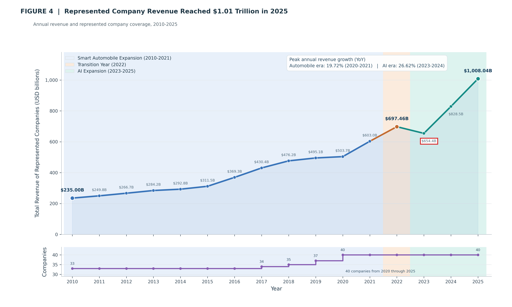

<i>Figure 4. รายได้รวมของบริษัทที่ปรากฏในชุดข้อมูลและจำนวนบริษัทที่ครอบคลุมระหว่างปี 2010–2025</i>

รายได้รวมของบริษัทในชุดข้อมูลเพิ่มขึ้นอย่างต่อเนื่องเกือบตลอดช่วงปี 2010–2022 โดยเพิ่มจาก 235.00 พันล้านดอลลาร์ เป็น 697.46 พันล้านดอลลาร์ อย่างไรก็ตาม แนวโน้มดังกล่าวหยุดลงในปี 2023 เมื่อรายได้ลดเหลือ 654.4 พันล้านดอลลาร์ หรือลดลงประมาณ 6.2% จากปีก่อน ก่อนฟื้นตัวอย่างรวดเร็วเป็น 828.5 พันล้านดอลลาร์ในปี 2024 และเพิ่มต่อเป็น 1,008.04 พันล้านดอลลาร์ในปี 2025

การลดลงในปี 2023 ไม่น่าจะเกิดจากจำนวนบริษัทในชุดข้อมูล เพราะข้อมูลครอบคลุมบริษัท 40 แห่งเท่ากันตั้งแต่ปี 2020–2025 จึงควรตรวจสอบต่อว่าการเปลี่ยนแปลงมาจากผลประกอบการของบริษัทและกลุ่มธุรกิจใด มากกว่าการเพิ่มหรือลดจำนวนบริษัทที่นำมารวม

</h2>

<h2 align="left">
5. การลดลงของรายได้ในปี 2023 เกิดขึ้นพร้อมกับการอ่อนตัวของราคา DRAM และ NAND
</h2>

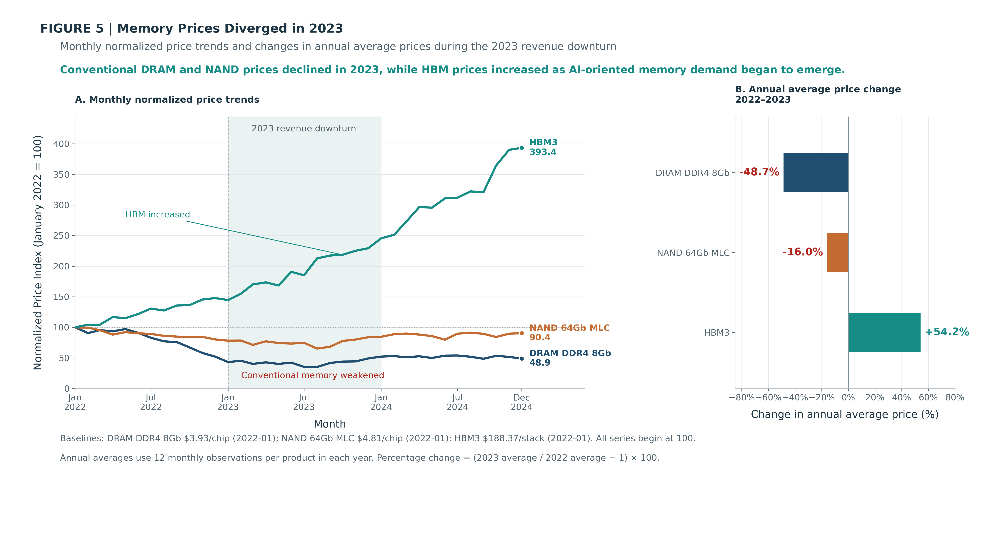

<i>Figure 5. ราคา DRAM และ NAND ลดลง ขณะที่ HBM3 เติบโตสวนทางในปี 2023</i>

Figure 5 เปรียบเทียบราคาของหน่วยความจำสามประเภทที่มีการใช้งานแตกต่างกัน ได้แก่ DRAM DDR4 ซึ่งเป็นหน่วยความจำชั่วคราวสำหรับคอมพิวเตอร์และเซิร์ฟเวอร์ NAND MLC ซึ่งใช้จัดเก็บข้อมูลในอุปกรณ์ เช่น SSD และ HBM3 ซึ่งเป็นหน่วยความจำความเร็วสูงสำหรับ GPU ระบบ AI และการประมวลผลสมรรถนะสูง

เนื่องจากผลิตภัณฑ์ทั้งสามมีราคาและหน่วยวัดแตกต่างกัน กราฟด้านซ้ายจึงกำหนดราคาของเดือนมกราคม 2022 ให้มีค่าดัชนีเท่ากับ 100 เพื่อเปรียบเทียบทิศทางการเปลี่ยนแปลงบนมาตรวัดเดียวกัน หากดัชนีสูงกว่า 100 หมายถึงราคาสูงขึ้นจากเดือนฐาน ส่วนค่าต่ำกว่า 100 หมายถึงราคาลดลง

กราฟด้านขวาเปรียบเทียบราคาเฉลี่ยระหว่างปี 2022–2023 พบว่าราคา DRAM ลดลง 48.7% และราคา NAND ลดลง 16.0% ขณะที่ราคา HBM3 เพิ่มขึ้น 54.2% ส่วนกราฟด้านซ้ายแสดงว่าแนวโน้มดังกล่าวดำเนินต่อไปจนถึงปลายปี 2024 โดยดัชนี DRAM และ NAND อยู่ที่ 48.9 และ 90.4 ตามลำดับ ขณะที่ดัชนี HBM3 เพิ่มขึ้นเป็น 393.4

ผลลัพธ์นี้แสดงว่าตลาดหน่วยความจำในปี 2023 ไม่ได้เปลี่ยนแปลงไปในทิศทางเดียวกัน หน่วยความจำทั่วไปอย่าง DRAM และ NAND เผชิญแรงกดดันด้านราคา ขณะที่ HBM3 ซึ่งใช้กับงานประมวลผลที่มีประสิทธิภาพสูงกว่ากลับมีราคาเพิ่มขึ้นอย่างต่อเนื่อง การอ่อนตัวของ DRAM และ NAND ยังเกิดขึ้นในช่วงเดียวกับที่ Figure 4 แสดงว่ารายได้รวมของบริษัทในชุดข้อมูลลดลงจาก 697.46 พันล้านดอลลาร์ในปี 2022 เหลือ 654.40 พันล้านดอลลาร์ในปี 2023 จึงเป็นไปได้ว่าแรงกดดันด้านราคาหน่วยความจำอาจเกี่ยวข้องกับรายได้ที่ลดลงของบริษัทผู้ผลิตหน่วยความจำบางเพียงบางแห่ง
</h2>

<h2 align="left">
6. ภาพรวม: กลุ่มที่รายได้ลดลงมากที่สุดและเป็นกลุ่มหลักคือ IDM
</h2>

จาก Figure 3 แสดงให้เห็นว่าความสามารถในการทำกำไรของแต่ละกลุ่มได้รับผลกระทบไม่เท่ากันในช่วงปี 2023–2025 โดยกลุ่ม IDM ปรับตัวลดลงมากที่สุด ส่วนนี้จึงเจาะลงไปในระดับรายได้ว่าการลดลงในปี 2023 กระจุกตัวอยู่ที่กลุ่มใด และภายในกลุ่มนั้นอยู่ที่ประเภทธุรกิจใด ก่อนจะทดสอบสมมติฐานเรื่องสาเหตุทีละข้อ

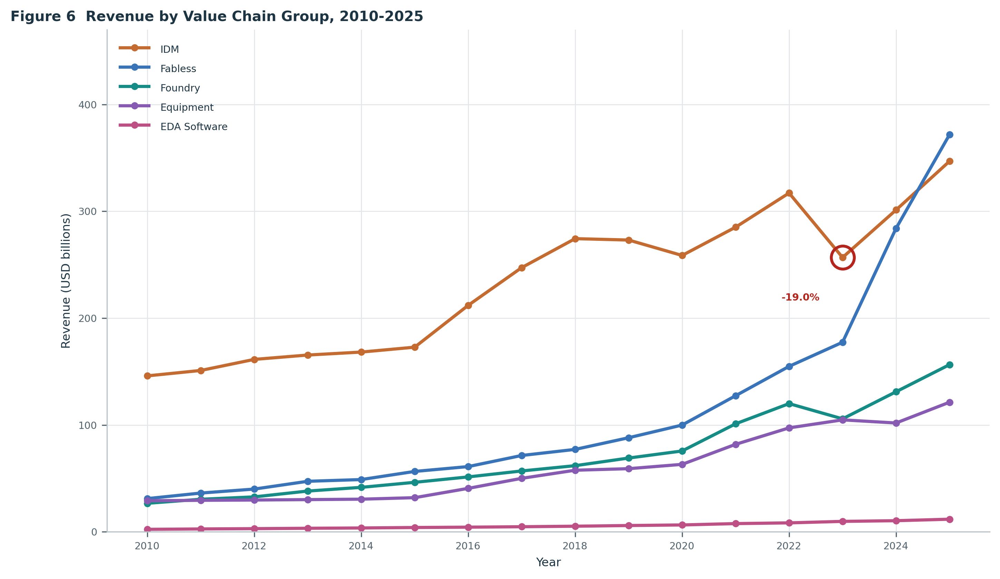

<i>Figure 6. รายได้แยกตามกลุ่มในห่วงโซ่คุณค่า ปี 2010–2025 วงกลมสีแดงคือกลุ่ม IDM ในปี 2023 ซึ่งเป็นการลดลงที่รุนแรงที่สุดที่เกิดกับกลุ่มใดกลุ่มหนึ่งตลอด 16 ปีของชุดข้อมูล</i>

Figure 6 แยกรายได้ตามกลุ่มในห่วงโซ่คุณค่าทั้งห้ากลุ่ม เพื่อระบุว่าการลดลงของรายได้รวมในปี 2023 เกิดขึ้นทั่วทั้งอุตสาหกรรมหรือกระจุกตัวอยู่ที่ใดที่หนึ่ง ผลลัพธ์แสดงว่าการลดลงไม่ได้เกิดขึ้นกับทุกกลุ่ม

| กลุ่ม | รายได้ 2022 (พันล้าน USD) | รายได้ 2023 (พันล้าน USD) | เปลี่ยนแปลง | สัดส่วนของรายได้รวมปี 2023 |
|---|---:|---:|---:|---:|
| IDM | 317.07 | 256.74 | −19.0% | 39.2% |
| Fabless | 154.83 | 177.40 | +14.6% | 27.1% |
| Foundry | 119.96 | 105.72 | −11.9% | 16.2% |
| Equipment | 97.26 | 104.75 | +7.7% | 16.0% |
| EDA Software | 8.34 | 9.74 | +16.8% | 1.5% |

กลุ่ม IDM เป็นทั้งกลุ่มที่ใหญ่ที่สุดในชุดข้อมูล โดยมีสัดส่วน 39.2% ของรายได้รวมในปี 2023 และเป็นกลุ่มที่ลดลงมากที่สุดที่ −19.0% คิดเป็นเม็ดเงินที่หายไป 60.33 พันล้านดอลลาร์ ส่วนกลุ่ม Foundry ลดลงเช่นกันที่ −11.9% แต่คิดเป็นเม็ดเงิน 14.24 พันล้านดอลลาร์ หรือประมาณหนึ่งในสี่ของกลุ่ม IDM ขณะที่กลุ่ม Fabless, Equipment และ EDA Software ยังเติบโตตามปกติในปีเดียวกัน

เนื่องจากกลุ่ม IDM เป็นทั้งกลุ่มที่ใหญ่ที่สุดและลดลงมากที่สุด การเปลี่ยนแปลงของกลุ่มนี้จึงเป็นตัวกำหนดทิศทางของรายได้รวมทั้งอุตสาหกรรมในปี 2023 การวิเคราะห์ในส่วนถัดไปจึงเจาะลงไปที่กลุ่ม IDM เป็นหลัก

<h2 align="left">
7. ในกลุ่ม IDM ส่วนที่รายได้ลดลงจริง ๆ คือ Memory
</h2>

เมื่อเจาะลึกลงไปภายในกลุ่ม IDM พบว่ากลุ่มนี้ในชุดข้อมูลประกอบด้วยบริษัท 14 แห่ง แบ่งเป็น 7 ประเภทธุรกิจตามผลิตภัณฑ์หลัก ประเภทที่ใหญ่ที่สุดคือ Memory ซึ่งมี 5 บริษัท และในปี 2023 มีรายได้ 100.09 พันล้านดอลลาร์ คิดเป็นประมาณ 39% ของรายได้ทั้งกลุ่ม IDM

| ประเภทธุรกิจ | จำนวนบริษัท | รายได้ 2023 (พันล้าน USD) | เปลี่ยนแปลง 2022→2023 (พันล้าน USD) |
|---|---:|---:|---:|
| Memory | 5 | 100.09 | −49.61 |
| CPU | 1 | 53.91 | −10.20 |
| Automotive | 3 | 40.01 | +0.40 |
| Analog | 2 | 29.00 | −2.28 |
| Diversified | 1 | 17.60 | +1.59 |
| Power | 1 | 8.30 | −0.06 |
| Microcontroller | 1 | 7.83 | −0.17 |

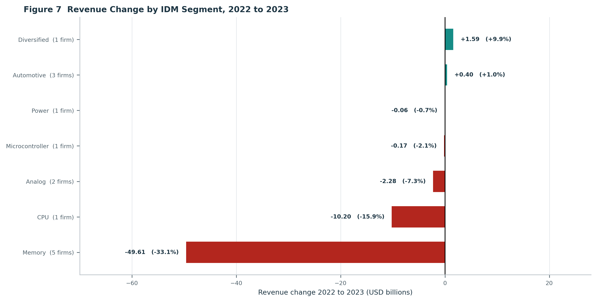

<i>Figure 7. การเปลี่ยนแปลงรายได้ของแต่ละประเภทธุรกิจในกลุ่ม IDM ระหว่างปี 2022 ถึง 2023 ตัวเลขในวงเล็บหลังชื่อประเภทธุรกิจคือจำนวนบริษัทในประเภทนั้น</i>

รายได้ของกลุ่ม IDM ลดลงรวม 60.33 พันล้านดอลลาร์ โดยประเภทธุรกิจ Memory คิดเป็น 49.61 พันล้านดอลลาร์ หรือประมาณ 82% ของการลดลงทั้งกลุ่ม ประเภทที่ลดลงรองลงมาคือ CPU ที่ 10.20 พันล้านดอลลาร์ ส่วนอีก 5 ประเภทที่เหลือรวมกันเคลื่อนไหวไม่ถึง 1 พันล้านดอลลาร์ และมีทั้งที่เพิ่มขึ้นและลดลง

ผลลัพธ์นี้ทำให้ขอบเขตของคำถามแคบลงอย่างมาก คำอธิบายการลดลงของรายได้ในปี 2023 จึงเท่ากับคำอธิบายสิ่งที่เกิดขึ้นกับผู้ผลิตหน่วยความจำ 5 รายในกลุ่ม IDM เป็นหลัก การวิเคราะห์ในสองส่วนถัดไปจึงตั้งสมมติฐานสองข้อเกี่ยวกับสาเหตุ แล้วทดสอบกับข้อมูลทีละข้อ โดยเรียงจากคำอธิบายที่สังเกตเห็นได้ชัดที่สุดไปหาคำอธิบายที่ต้องตรวจสอบลึกที่สุด

<h2 align="left">
8. สมมติฐาน A: มาตรการควบคุมการส่งออกที่เพิ่มขึ้น
</h2>

สมมติฐานข้อแรกมาจากข้อสังเกตที่เห็นได้ชัดที่สุด คือในปี 2023 มีเหตุการณ์ควบคุมการส่งออกบันทึกไว้ 7 ครั้ง ซึ่งเป็นจำนวนสูงสุดในช่วงปี 2018 ถึง 2026 ที่ชุดข้อมูลครอบคลุม และเป็นปีเดียวกับที่รายได้รวมลดลง สมมติฐานนี้จึงเสนอว่ามาตรการดังกล่าวเป็นสาเหตุ โดยจำกัดความสามารถของบริษัทในการขายสินค้าหรือเข้าถึงเทคโนโลยี การทดสอบแบ่งเป็นสองระดับ คือระดับอุตสาหกรรมและระดับบริษัท

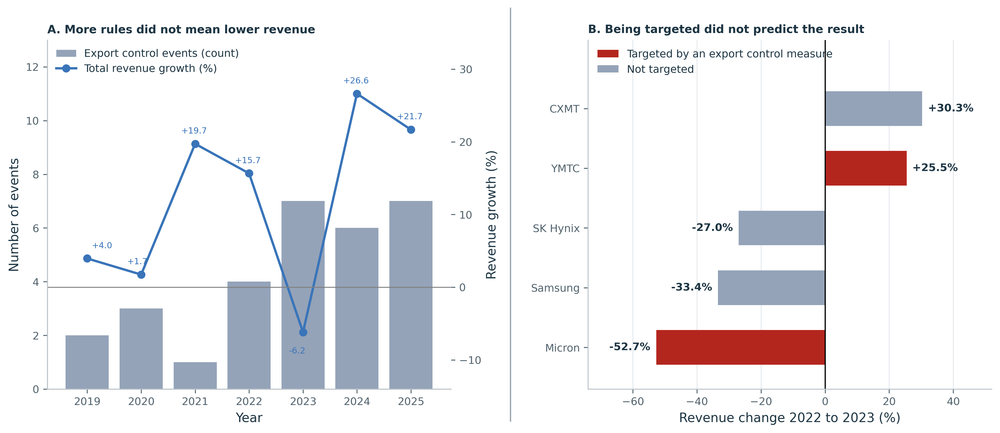

<i>Figure 8. ซ้าย: จำนวนเหตุการณ์ควบคุมการส่งออกเทียบกับการเติบโตของรายได้รวม ปี 2019–2025  ขวา: การเปลี่ยนแปลงรายได้ของบริษัทผู้ผลิตหน่วยความจำทั้ง 5 ราย ระหว่างปี 2022 ถึง 2023 แท่งสีแดงคือบริษัทที่ถูกระบุชื่อเป็นเป้าหมายในข้อมูลมาตรการควบคุมการส่งออก</i>

ผลการทดสอบเป็นการปฏิเสธสมมติฐานนี้ทั้งสองระดับ

ในระดับอุตสาหกรรม ปี 2024 มีเหตุการณ์ 6 ครั้ง และปี 2025 มีอีก 7 ครั้งเท่ากับปี 2023 แต่รายได้รวมกลับเติบโต 26.6% และ 21.7% ตามลำดับ ส่วนปี 2021 ที่มีเหตุการณ์เพียงครั้งเดียวก็เติบโต 19.7% ค่าสหสัมพันธ์ระหว่างจำนวนเหตุการณ์กับอัตราการเติบโตของรายได้ตลอดช่วงปี 2019–2025 อยู่ที่เพียง +0.04

ในระดับบริษัท จากมาตรการทั้งหมด 34 รายการที่บันทึกไว้ มีเพียง 2 รายการที่ระบุชื่อผู้ผลิตหน่วยความจำโดยตรง คือการขึ้นบัญชี Entity List ของสหรัฐอเมริกาต่อ Yangtze Memory (YMTC) เมื่อเดือนธันวาคม 2022 และการที่จีนสั่งห้ามใช้ชิปของ Micron ในโครงสร้างพื้นฐานสำคัญเมื่อเดือนพฤษภาคม 2023 ผลลัพธ์ของทั้งสองรายกลับตรงข้ามกันสุดขั้ว YMTC มีรายได้เพิ่มขึ้น 25.5% ในปี 2023 ขณะที่ Micron ลดลง 52.7% ในขณะเดียวกัน Samsung Memory และ SK Hynix ที่ไม่ถูกระบุชื่อเลยกลับลดลง 33.4% และ 27.0% ส่วน ChangXin (CXMT) ที่ไม่ถูกระบุชื่อเช่นกัน เพิ่มขึ้น 30.3% การถูกระบุเป็นเป้าหมายจึงไม่ใช่ตัวทำนายผลลัพธ์

คำอธิบายด้านการแข่งขันถูกปฏิเสธเช่นกัน หากผู้ผลิตรายใหม่จากจีนแย่งส่วนแบ่งตลาดไป รายได้ที่หายไปควรไปปรากฏที่ CXMT และ YMTC แต่สองรายนี้รวมกันเพิ่มขึ้นเพียง 1.99 พันล้านดอลลาร์ ในปีที่ผู้ผลิตรายใหญ่สามรายรวมกันลดลง 51.60 พันล้านดอลลาร์ รายได้จึงไม่ได้ย้ายไปหาคู่แข่ง แต่หายไปจากตลาดโดยรวม ซึ่งชี้ไปที่คำอธิบายในระดับตลาดมากกว่าระดับบริษัท

<h2 align="left">
9. สมมติฐาน B: ภาวะอุปทานล้นตลาด
</h2>

สมมติฐานนี้เสนอว่า ผู้ผลิตขยายกำลังการผลิตในช่วงที่ตลาดกำลังร้อนแรง เมื่อกำลังการผลิตใหม่เดินเครื่องพร้อมกัน ปริมาณสินค้าในตลาดจึงมากเกินความต้องการ ราคาจึงลดลง และรายได้ลดลงตามราคา ไม่ใช่ตามปริมาณที่ขายได้

ในบรรดาหน่วยความจำสามชนิดที่มีข้อมูลราคา การวิเคราะห์ส่วนนี้ใช้เฉพาะ DRAM เพราะเป็นชนิดที่ราคาลดลงรุนแรงที่สุด คือ 55.3% ระหว่างปี 2021 ถึง 2023 เทียบกับ NAND ที่ลดลง 24.9% และเป็นชนิดเดียวที่มีข้อมูลกำลังการผลิตมากพอจะสร้างกลุ่มเปรียบเทียบได้ และมีบันทึกต่อเนื่องทุกปีตลอดช่วงปี 2020–2025 ขณะที่ NAND มีเพียงข้อมูลกำลังการผลิตจากบริษัทเดียวในชุดข้อมูลทั้งหมด จึงใช้แทนอุปทานของทั้งตลาดไม่ได้ ส่วน HBM มีบันทึกกำลังการผลิตเพียงรายการเดียวในปี 2026 และมีข้อมูลราคาตั้งแต่ปี 2022 จึงเทียบกับปีฐาน 2021 ไม่ได้ อีกทั้งราคายังเพิ่มขึ้นสวนทางรายได้ของรายได้รวมของกลุ่มธุรกิจที่ลดลง

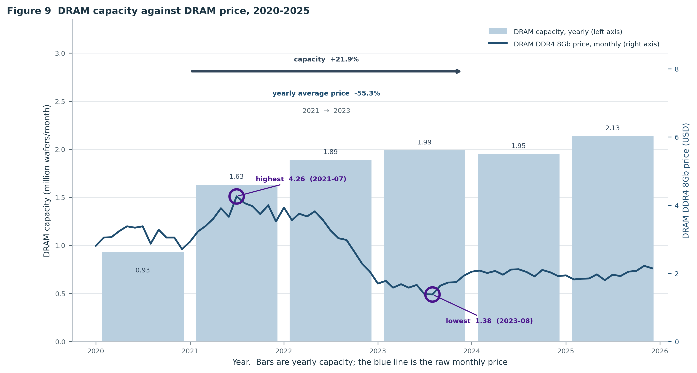

<i>Figure 9. แท่งสีฟ้าคือกำลังการผลิต DRAM รายปีตลอดช่วงปี 2020–2025 หน่วยเป็นล้านแผ่นเวเฟอร์ต่อเดือน เส้นสีน้ำเงินคือราคา DRAM DDR4 8Gb รายเดือนตามที่บันทึกไว้ โดยไม่ผ่านการเฉลี่ย วงกลมสีม่วงคือเดือนที่ราคาสูงสุดและต่ำสุดในช่วงเวลาดังกล่าว</i>

กำลังการผลิต DRAM ของผู้ผลิตชุดเดียวกันเพิ่มจาก 1.63 ล้านเป็น 1.99 ล้านแผ่นเวเฟอร์ต่อเดือนระหว่างปี 2021 ถึง 2023 หรือ 21.9% ขณะที่ราคาเฉลี่ยรายปีลดลงจาก 3.69 เหลือ 1.65 ดอลลาร์ หรือ 55.3% โดยราคารายเดือนไต่ลงจากจุดสูงสุดที่ 4.26 ดอลลาร์ในเดือนกรกฎาคม 2021 ไปแตะจุดต่ำสุดที่ 1.38 ดอลลาร์ในเดือนสิงหาคม 2023

คำถามที่ตามมาคือ การเพิ่มกำลังการผลิต 21.9% เพียงพอที่จะทำให้ราคาลดลงถึง 55.3% หรือไม่ วิธีตอบคือนำตัวเลขทั้งสองมาวางบนแผนภาพอุปสงค์และอุปทาน แล้วเทียบว่าการเลื่อนของเส้นอุปทานเพียงอย่างเดียวควรทำให้ราคาลดลงเท่าใด กับราคาที่เกิดขึ้นจริง

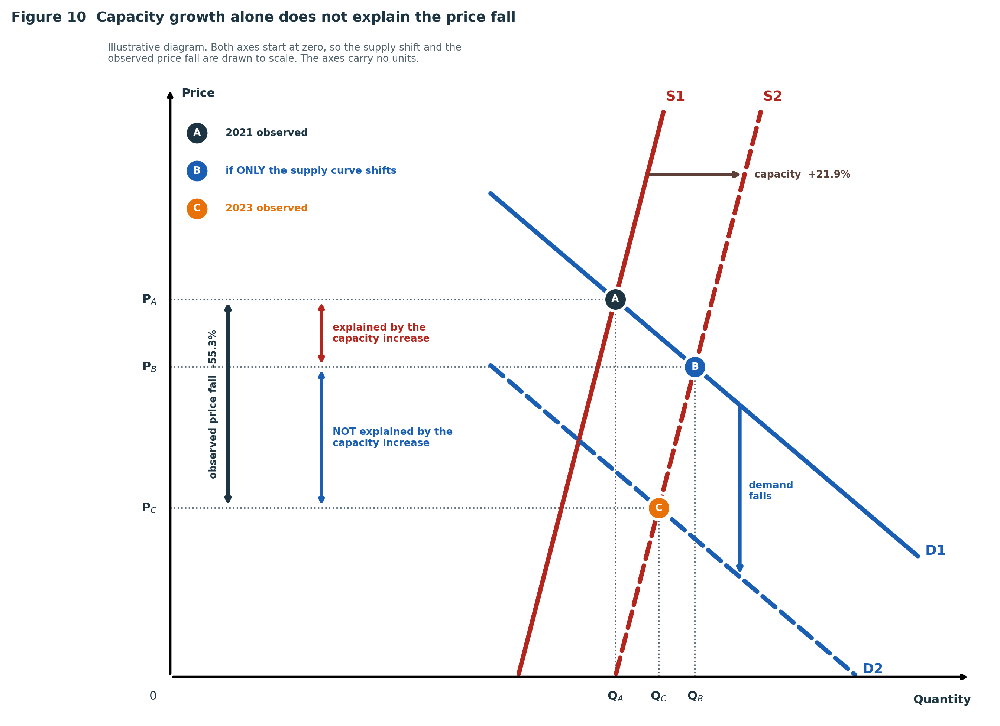

<i>Figure 10. แผนภาพเชิงแนวคิดแสดงกลไกของภาวะอุปทานล้นตลาด แกนทั้งสองเริ่มที่ศูนย์ ระยะการเลื่อนของเส้นอุปทานและระดับราคาถูกวาดตามสัดส่วนของข้อมูลจริง แกนทั้งสองไม่มีหน่วย</i>

<b>S1</b> และ <b>S2</b> คือเส้นอุปทาน (Supply) ของ DRAM ในปี 2021 และ 2023 ตามลำดับ แสดงปริมาณที่ผู้ผลิตยินดีขาย ณ ระดับราคาต่าง ๆ เส้นทั้งสองมีความชันสูงเพราะกำลังการผลิตปรับเปลี่ยนได้ยากในระยะสั้น โดย S2 คือ S1 ที่เลื่อนไปทางขวาตามกำลังการผลิตที่เพิ่มขึ้น 21.9% ส่วน <b>D1</b> และ <b>D2</b> คือเส้นอุปสงค์ (Demand) ในปี 2021 และ 2023 แสดงปริมาณที่ผู้ซื้อต้องการ ณ ระดับราคาต่าง ๆ เส้นลาดลงเพราะเมื่อราคาลดลง ผู้ซื้อย่อมต้องการปริมาณมากขึ้น และ D2 คือ D1 ที่เลื่อนลงมาหลังความต้องการจากตลาดปลายทางลดลง จุดตัดของสองเส้นคือดุลยภาพของตลาด ซึ่งกำหนดราคาและปริมาณที่เกิดขึ้นจริง

| จุด | ความหมาย |
|---|---|
| A | ดุลยภาพจริงในปี 2021 ราคา DRAM DDR4 8Gb อยู่ที่ 3.69 ดอลลาร์ |
| B | ดุลยภาพที่ควรเกิดขึ้น หากมีเพียงเส้นอุปทานที่เลื่อนไปทางขวา 21.9% |
| C | ดุลยภาพจริงในปี 2023 ราคาอยู่ที่ 1.65 ดอลลาร์ ต่ำกว่าจุด A อยู่ 55.3% |

เนื่องจากแกนทั้งสองเริ่มที่ศูนย์ จึงเทียบสัดส่วนได้โดยตรง ระยะจาก S1 ถึง S2 เป็นเพียงประมาณหนึ่งในห้าของระยะจากแกนตั้งถึง QA ขณะที่ราคาที่จุด C อยู่ต่ำกว่าครึ่งหนึ่งของราคาที่จุด A การเลื่อนของเส้นอุปทานที่สั้นเช่นนี้ย้ายดุลยภาพจากจุด A ไปได้เพียงจุด B เท่านั้น ระยะจาก PB ถึง PC จึงเป็นส่วนที่การเพิ่มกำลังการผลิตอธิบายไม่ได้ และเป็นไปได้ก็ต่อเมื่อเส้นอุปสงค์เลื่อนลงจาก D1 เป็น D2 ด้วย

ผลการทดสอบจึงเป็นการยอมรับบางส่วน ภาวะอุปทานล้นตลาดเกิดขึ้นจริงและเป็นสาเหตุโดยตรงของการลดลงของรายได้กลุ่ม Memory แต่ไม่ได้เกิดจากการเพิ่มกำลังการผลิตเพียงอย่างเดียว ส่วนที่เหลือมาจากการหดตัวของอุปสงค์ปลายทางในเวลาเดียวกัน

โดยสรุป สมมติฐาน B ได้รับการยอมรับบางส่วน ภาวะอุปทานล้นตลาดเกิดขึ้นจริงและทำให้รายได้ของกลุ่ม Memory ลดลงผ่านราคา แต่การเพิ่มกำลังการผลิต 21.9% อธิบายการลดลงของราคา 55.3% ได้ไม่ทั้งหมด จึงต้องมีการเปลี่ยนแปลงฝั่งอุปสงค์ประกอบด้วย ทั้งนี้ ชุดข้อมูลไม่ได้บันทึกปริมาณการผลิตหรือการขายจริง ข้อสรุปนี้จึงอยู่ในมิติของราคาเท่านั้น
 

<h2 align="left">
10. ภาพรวมตลาดเซมิคอนดักเตอร์ ตั้งเเต่ปี 2010-2025
</h2>

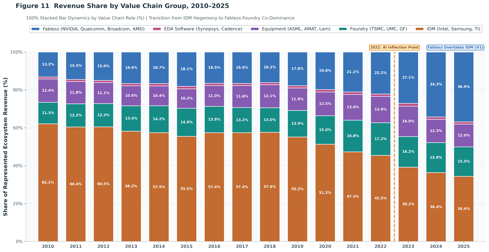

<i>Figure 11. Revenue Share by Value Chain Group, 2010-2025</i>

จากโลกเซมิคอนดักเตอร์ในยุคก่อนที่ IDM ครองตลาด พอยุคสมัยเริ่มเปลี่ยนไป อุตสาหกรรมกลุ่ม Flabless และ Foundry ได้เริ่มมีบทบาทเข้ามา

ในปี 2010 โครงสร้างอุตสาหกรรมชิปโลกถูกครอบครองด้วยอุตสาหกรรมกลุ่ม IDM  หรือบริษัทที่ออกแบบเองและผลิตเองในโรงงานของตัวเองอย่าง Intel, Samsung, และ Texas Instruments ซึ่งครองส่วนแบ่งรายได้ในตลาด ถึง 62.1% ในขณะเดียวกันช่วงปี 2011–2021 ต้นทุนการสร้างโรงงานชิป เริ่มเพิ่มสูงขึ้น แล้วในช่วงปี 2011-2021 เริ่มเข้ามาแย่งส่วนแบ่งทีละน้อยคือ Fabless และ Foundry ทำให้ส่วนแบ่งของ IDM ลดลงอย่างต่อเนื่องจนเหลือ 45.5% ในปี 2022 จุดสำคัญในปี 2022 เกิด AI Inflection Point ขึ้น หลังจากการมาถึงของ Generative AI สัดส่วนของ Fabless เติบโตก้าวกระโดดจาก 22.2% ในปี 2022 พุ่งขึ้นเป็น 27.1% ในปี 2023 และแซง IDM ขึ้นเป็นอันดับ 1 อย่างเป็นทางการ โดยมีสัดส่วนแตะ 36.9% ในปี 2025 ขณะที่ IDM เหลือเพียง 34.4%" 

สิ่งสำคัญที่ห้ามมองข้ามคือ Foundry (~15-17%) และ Equipment ผู้ผลิตเครื่องจักร (~12-16%) แม้สัดส่วนเปอร์เซ็นต์จะดูทรงตัว แต่เป็นหลักที่ขาดไม่ได้ เพราะถ้าไม่มีเครื่องจักรของ ASML และโรงงานของ TSMC ฝั่ง Fabless ก็ไม่สามารถสร้างชิป AI ออกมาได้

<h2 align="left">
11. เจ้าตลาด 3 อันดับเเรกในปี 2010-2025
</h2>

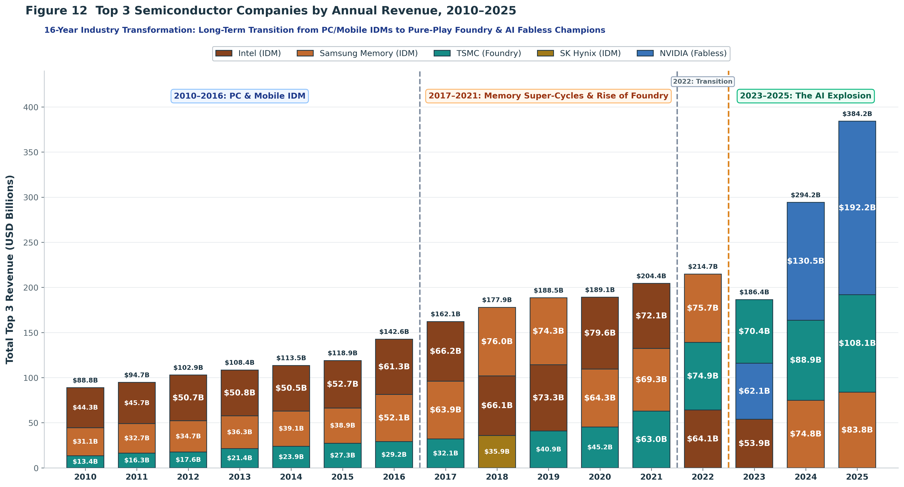

<i>Figure 12. Top 3 Semiconductor Companies by Annual Revenue, 2010-2025</i>

2010–2016 ในยุคแรก รายได้รวมของ Top 3 ค่อยๆ ขยับจาก 88.8 พันล้านดอลลาร์  สู่ 142.6 พันล้านดอลลาร์ ผู้นำเบอร์ 1 คือ Intel ทำรายได้เหนียวแน่นจากตลาด PC และ Server ตั้งแต่ 44.3 พันล้านดอลลาร์ ขึ้นไปถึง 61.3 พันล้านดอลลาร์ โดยมี Samsung Memory ครองเบอร์ 2 จากตลาดสมาร์ตโฟน และ TSMC เริ่มไต่อันดับเข้ามาด้วยรายได้เริ่มต้นเพียง 13.4 พันล้านดอลลาร์

2017-2021 พอเข้าสู่ยุคที่สอง อุตสาหกรรมเข้าสู่รอบ Memory Super-Cycle ตลาดคลาวด์และดาต้าเซ็นเตอร์บูมอย่างหนัก ทำให้ Samsung Memory สามารถแซง Intel ขึ้นมาเป็นเบอร์ 1 ได้ในปี 2017 (63.9 พันล้านดอลลาร์) และ 2018 (76.0 พันล้านดอลลาร์) ขณะที่ SK Hynix (สีเหลืองทอง) ก็แทรกเข้ามาติด Top 3 ได้ในปี 2018 เช่นกัน ในเวลาเดียวกัน TSMC เริ่มนำหน้าด้านกระบวนการผลิต 7nm และ 5nm กวาดลูกค้ารายใหญ่ทั้ง Apple และ AMD ส่งผลให้รายได้ทะลุ 63.0 พันล้านดอลลาร์ ในปี 2021 ผลักดันเค้กรวม Top 3 ทะลุ 204.4 พันล้านดอลลาร์

2022 คือปีแห่งจุดเปลี่ยนผ่านและเป็นจุดพีคของรอบวัฏจักรเดิม Samsung ยืนเบอร์ 1 ที่ 75.7 พันล้านดอลลาร์ ตามติดด้วย TSMC 74.9 พันล้านดอลลาร์ และ Intel 64.1 พันล้านดอลลาร์ ก่อนที่เศรษฐกิจหลังโควิดจะทำให้ตลาด PC, สมาร์ตโฟน และชิปหน่วยความจำดิ่งลง

2023-2025 เมื่อเข้าสู่ยุคที่สาม การมาถึงของคลื่น AI ทำให้เกิดการจัดระเบียบโลกใหม่ เค้กของ Top 3 ระเบิดขึ้นอย่างมหาศาลจาก 186.4 พันล้านดอลลาร์ สู่ 294.2 พันล้านดอลลาร์ ในปี 2024 และพุ่งทะยานแตะ 384.2 พันล้านดอลลาร์ ในปี 2025 ซึ่งปัจจัยขับเคลื่อนหลักจากชิป Accelerator ของ NVIDIA และการขยายกำลังผลิตระดับสูงของ TSMC 

<h2 align="left">
12. เจาะลึกปี 2023 
</h2>

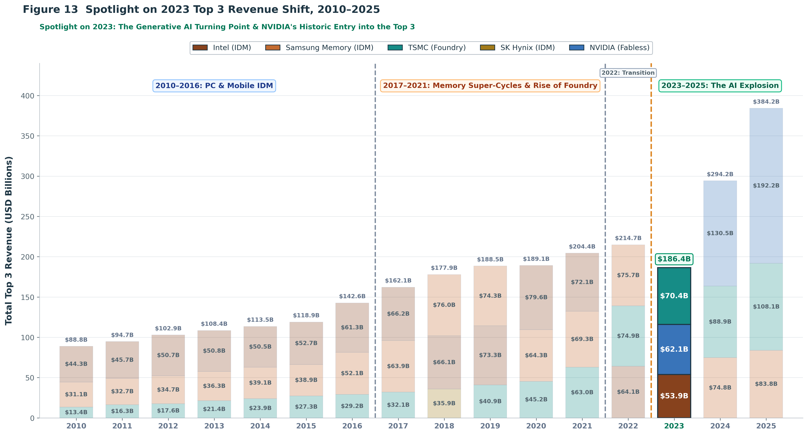

<i>Figure 13. figure13_top3_revenue_2023</i>

กราฟนี้เราจะมาอธิบายจุดเปลี่ยนสำคัญทางธุรกิจในปี 2023 เราจะมีพูดถึง 2 เรื่องคือ 
1. Nvidia มาได้อย่างไร
2. ทำไม TSMC ถึงมาเป็นอันดับ 1 ได้ แม้อุตสาหกรรมในภาพรวมจะหดตัว

สังเกตแท่งปี 2023 ยอดรวมของ Top 3 ลดลงจากปีก่อนหน้ามาอยู่ที่ 186.4 พันล้านดอลลาร์ เนื่องจากเกิดวิกฤต Memory ตกต่ำอย่างรุนแรง ทำให้ Samsung หลุดจาก Top 3 เป็นครั้งแรกในรอบกว่าสิบปี และ Intel รายได้ร่วงลงเหลือ 53.9 พันล้านดอลลาร์  

### ทำไม NVIDIA ถึงขึ้นมาเป็นเบอร์ 2
ซึ่งกระโดดเข้ามาติด Top 3 เป็นอันดับที่ 2 ด้วยรายได้สูงถึง 62.1 พันล้านดอลลาร์  แซงหน้า Intel จากกระแสการเข้ามาของ Generative AI และการแย่งชิงชิปตระกูล H100 ทั่วโลก 

### ทำไม TSMC ถึงยังยืนหนึ่งเป็นแชมป์ (70.4 พันล้านดอลลาร์ )
คำถามที่น่าสนใจตลาดชิปหดตัว ทำไม TSMC ซึ่งเป็นอุตสาหกรรมแบบ Foundry ถึงยังยืนระยะเป็นเบอร์ 1 ได้ด้วยรายได้ 70.4 พันล้านดอลลาร์ 

1. TSMC คือผู้ผลิตชิป AI ให้ NVIDIA แต่เพียงผู้เดียว ชิป AI ทุกตัวของ NVIDIA ต้องใช้กระบวนการผลิตขั้นสูง 4nm ของ TSMC
2. เทคโนโลยี CoWoS (Advanced Packaging): การประกอบ GPU เข้ากับหน่วยความจำ HBM ความเร็วสูง จำเป็นต้องใช้เทคโนโลยีบรรจุภัณฑ์ขั้นสูง ซึ่งทั้งโลกมีเพียง TSMC ที่ทำได้ในระดับอุตสาหกรรม ทำให้ TSMC มีอำนาจต่อรองด้านราคา (Pricing Power) และยังคงเติบโตอย่างต่อเนื่อง

### บทสรุป

โครงการนี้วิเคราะห์บริษัทเซมิคอนดักเตอร์ตามบทบาทในห่วงโซ่คุณค่า พบว่ารายได้ในชุดข้อมูลกระจุกตัวอยู่ในสหรัฐอเมริกา เกาหลีใต้ และไต้หวัน แต่ละพื้นที่มีความเชี่ยวชาญแตกต่างกัน โดยสหรัฐฯ เด่นด้าน Fabless เกาหลีใต้เด่นด้าน IDM และไต้หวันเด่นด้าน Foundry ขณะเดียวกัน EDA Software และ Foundry สามารถรักษาอัตรากำไรจากการดำเนินงานได้ค่อนข้างสม่ำเสมอ ส่วน IDM มีความผันผวนมากที่สุด

ในปี 2023 รายได้รวมของบริษัทในชุดข้อมูลลดลง 6.2% โดยกลุ่ม IDM มีรายได้ลดลงมากที่สุดที่ 60.33 พันล้านดอลลาร์ และประมาณ 82% ของการลดลงในกลุ่มนี้มาจากธุรกิจ Memory โดยเฉพาะผู้ผลิต DRAM และ NAND ขณะที่กลุ่ม Fabless, Equipment และ EDA Software ยังคงมีรายได้เพิ่มขึ้น แสดงว่าภาวะชะลอตัวไม่ได้เกิดขึ้นเท่าเทียมกันตลอดทั้งอุตสาหกรรม

การลดลงดังกล่าวเกิดขึ้นพร้อมกับราคา DRAM และ NAND ที่อ่อนตัว ขณะที่ราคา HBM3 ซึ่งใช้ในการประมวลผล AI เพิ่มขึ้นสวนทาง ข้อมูลยังแสดงว่ากำลังการผลิต DRAM เพิ่มขึ้นในช่วงที่ราคาลดลง จึงสอดคล้องกับคำอธิบายเรื่องอุปทานส่วนเกินที่เกิดขึ้นร่วมกับอุปสงค์จากตลาดทั่วไปที่อ่อนตัว ส่วนสมมติฐานว่ามาตรการควบคุมการส่งออกเป็นสาเหตุหลักยังไม่ได้รับการสนับสนุนอย่างชัดเจนจากข้อมูล

หลังปี 2023 รายได้ฟื้นตัวอย่างรวดเร็วพร้อมกับการเติบโตของ GPU, HBM, Data Center และการผลิตชิปขั้นสูง ส่งผลให้กลุ่ม Fabless และบริษัทอย่าง NVIDIA กับ TSMC มีบทบาทเพิ่มขึ้น อย่างไรก็ตาม ผลลัพธ์ทั้งหมดสะท้อนเฉพาะบริษัทที่ปรากฏในชุดข้อมูล ไม่ใช่อุตสาหกรรมเซมิคอนดักเตอร์ทั่วโลก และยังไม่สามารถใช้ยืนยันความเป็นเหตุและผลได้โดยตรง

